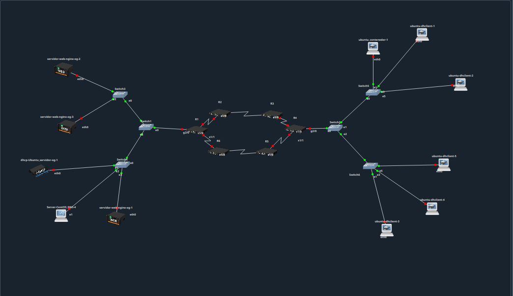

# 01 - Anillo 6 Routers OSPF

Topología en anillo con 6 routers para pruebas de convergencia y alta disponibilidad.

## 🎯 Objetivo
Validar OSPF en anillo, VLANs y servicios DHCP/DNS.

## 🌐 Topología Lógica
- **RT-01:** Gateway VLAN 50, 60
- **RT-04:** Gateway VLAN 5, 10, 15
- **RT-02, RT-03, RT-05, RT-06:** Tránsito OSPF
- **Enlaces:** /30 entre routers

## ⚙️ Configuraciones
- `configs/` - Running-configs de cada router
- `topologia.png` - Diagrama del anillo

## ✅ Pruebas
- `ping` entre VLANs
- `traceroute` para validar ruta
- `show ip ospf neighbor`
