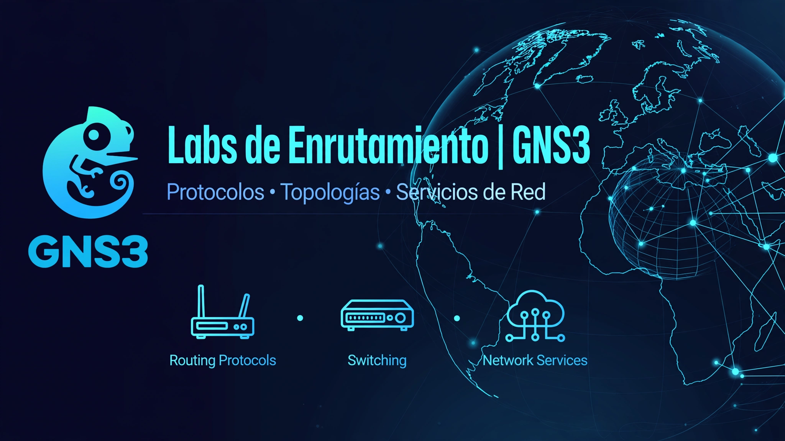

# GNS3-Routing-Labs

> Colección de laboratorios de enrutamiento en GNS3 con topologías en anillo y malla. Implementa OSPF, RIP, EIGRP, BGP, VLANs, DHCP Relay, DNS BIND9 y SSH. Incluye configuraciones de Cisco IOS, VyOS y clientes/servidores Ubuntu, con enfoque práctico en routing, switching y servicios de red.

## 📂 Labs
- [01-anillo-6-routers-ospf](./01-anillo-6-routers-ospf/) - Anillo 6 Routers | VLAN 50,60 en RT-01 y VLAN 5,10,15 en RT-04
- [02-vlan-routing-dhcp-relay](./02-vlan-routing-dhcp-relay/)
- [03-enterprise-ospf-dhcp-dns](./03-enterprise-ospf-dhcp-dns/)

## 🛠️ Stack
`GNS3` `Cisco IOS` `VyOS` `Ubuntu` `OSPF` `VLAN` `DHCP` `DNS` `SSH`

## 🚀 Uso
Abrir `.gns3project` en GNS3 VM.
